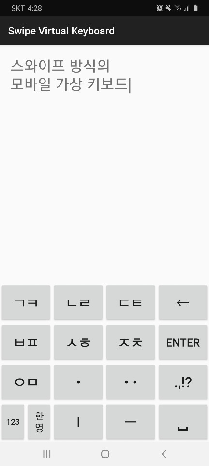

# **2020학년도 분당중 발명창의력대회**

*스와이프 방식의 모바일 가상 키보드*

---

> ## **Info** 
  
**- 제목** : 스와이프 방식의 모바일 가상 키보드   
**- 이름** : 유태우   
**- 학번** : 20110   
   
   
---
   
   
> ## **Download**   
   
**- 이름** : Keyboard_Installer.apk   
**- 확장자** : .apk (Android Application Package)   
**- 실행 환경** : Android (ios 사용 불가)   
**- 다운로드 경로** : <a href="https://docs.google.com/uc?export=download&id=1FndFV6EiUGab563KjtKxCeeTmP4uUiRU">[APK 다운로드]</a>   

**- 설치 방법**   
  1. apk 파일을 다운로드한다.   
  2. 스마트폰에서 다운로드한 위치에 들어가 Keyboard_Intaller.apk 파일을 찾아 실행시킨다.   
  3. 웹에서 다운로드 받은 파일이고, 검증받지 않은 파일이라 경고창이 뜰 수 있지만 위험한 파일이 아니므로, 권한을 요청하면 권한을 부여해준다.   
  4. 설치 중에 위험한 프로그램이라는 경고창이 뜬다면, 무시하고 설치를 진행한다.   
  5. 설치가 완료되면, Swipe Virtual Keyboard 라는 이름의 애플리케이션을 찾아 실행시킨다.   
   
   
---
   
   
> ## **Keyboard Manual**

   
**- 자음의 입력**   
1. 일반 입력 : 자음 버튼의 `첫번째 자음`이 입력된다.   
2. 위로 스와이프 : 자음 버튼의 `두번째 자음`이 입력된다.   
3. 아래로 스와이프 : `쌍자음`이 입력된다.  
ex) "ㄱㅋ" 버튼의 경우 : ( • = ㄱ, ↑ = ㅋ, ↓ = ㄲ )

**- 모음의 입력**   
+ 점 한개 (•)   
   스와이프 방향에 따라 `점 한개가 붙은 모음`이 입력된다. ( ↑ = ㅗ, ↓ = ㅜ, ← = ㅓ, → = ㅏ )   
      
+ 점 두개 (••)    
   스와이프 방향에 따라 `점 두개가 붙은 모음`이 입력된다. ( ↑ = ㅛ, ↓ = ㅠ, ← = ㅕ, → = ㅑ )   
   
+ ㅣ, ㅔ, ㅐ 의 입력   
   + 버튼 : `ㅣ` 버튼   
  1. 일반 입력 : `ㅣ` 입력   
  2. 왼쪽으로 스와이프 : `ㅔ` 입력   
  3. 오른쪽으로 스와이프 : `ㅐ` 입력   
     
+ ㅡ, ㅖ, ㅒ 의 입력   
   + 버튼 : `ㅡ` 버튼   
  1. 일반 입력 : `ㅡ` 입력   
  2. 왼쪽으로 스와이프 : `ㅖ` 입력   
  3. 오른쪽으로 스와이프 : `ㅒ` 입력   
  
**- 특수기호 (.,!?)의 입력**   
  + 버튼 : `.,!?` 버튼   
  1. 일반 입력 : `.` 입력   
  2. 왼쪽으로 스와이프 : `,` 입력   
  3. 위로 스와이프 : `?` 입력   
  4. 아래로 스와이프 : `!` 입력   
